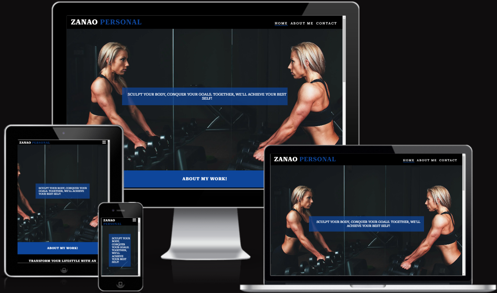
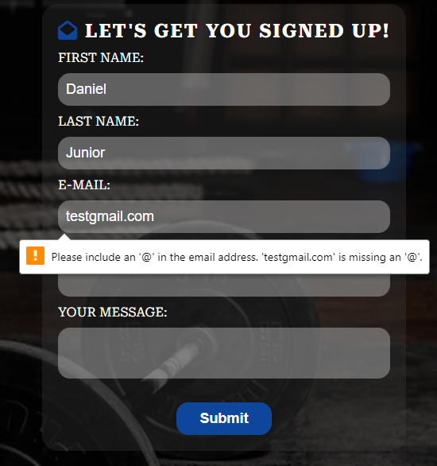

# Thiago Zanao Personal Trainer

Welcome to Thiago Zanao's Personal Trainer portfolio, your gateway to exploring the expertise of our top (fictional) Personal Trainer in Ireland. Discover more about the exceptional fitness journey that awaits you.

[Thiago Zanao WebSite](https://danijuniordev.github.io/zanao-personal/)

This webpage is designed to be a simple yet effective platform for a personal trainer. With responsiveness built into its design, it ensures accessibility across a wide range of devices.

## USER GOAL
To clearly see what the Zanao Personal services are.
Explore Your Customized Program: Tailored Fitness Solutions Just for You.
Motivation and Accountability: Empowering Your Fitness Journey with Inspiration and Commitment.
Technical Corrections: Ensuring Precision and Effectiveness in Your Fitness Program
Variety and Progression: Elevate Your Fitness Experience with Diverse Workouts and Steady Advancement.

#### Returning Visitor Goals
Create a fully functional and customized website, adding a personal touch. This platform not only enhances the owner's professional image but also provides users with the option to easily initiate contact and establish communication channels.

## FEATURES OF THE WEBSITE

### Navigation.
* Page links are centrally positioned in the header, subtly offset to the right for a visually appealing and user-friendly navigation experience.
* The page links feature a responsive design with a 'hover' animation, lighting up in a vibrant blue color when users hover over them. Once clicked, a distinct 'active' animation is applied, ensuring clarity by displaying a persistent blue border bottom to indicate the current page and enhance user navigation.
* The nav bar changes size and is readable when changing dimensions.

### Home - Page.
* The webpage features a captivating hero image, complemented by an inspiring motivational phrase. This impactful combination sets the tone for a positive and engaging user experience.
* A section that clarifies and details the program designed by a personal trainer.

### About Me - Page. 
* A captivating hero image paired with a powerful phrase encapsulating my unique and effective work methodology.
* 1 section featuring a personal photo accompanied by a brief narrative about myself, highlighting my journey and extensive experience as a dedicated personal trainer.

### Contact Me - Page.
* Background image and a complete contact form.

### Thank you - Page.

* After completing the form, upon submission, you will be directed to the thank-you page.

### Footer.

* The social media links are contained in the footer and are links to respective external social media links.

## Technologies

* VSCode - Used for all the coding.
* HTML: The structure of the website.
* CSS: Styling using custom CSS.
* GitHub: Source code hosting and deployment.
* Git: Version control.
* Font Awesome: Icons for social media links.
* Favicon.io: Favicon creation.
* Adobe Photoshop: Adobe Photoshop was used for resizing images for the website
* Pexels (a free stock photo site): Photos from Pexels were used for styling the headers of the page.
* Am I Responsive?: To show the website image on a range of devices.
* OpenAI Chat: Assisting with grammar errors.

## Testing

* The website has been tested changing the sizes and using navigation bar on follow browsers: Chrome, Microsoft Edge, Opera, Firefox, Safari.
* For mobile testing, Google Chrome DevTools were utilized, and additional testing was conducted on a personal iPhone 11 Pro.
* Responsive design has been implemented and tested on standard screen sizes using the device toolbar in Google Chrome DevTools.
* On the contact page, on the form had been checked:
  1. Not accepted has been flagged for missing information.
  2. The email input only accepts the email format.
  3. The phone number input only accepts numerical values

  
  
  
  

### Validator Testing.

* HTML
  *  I can confirm that all HTML on each page has passed without error in the official [W3C Validator](https://validator.w3.org/#validate_by_input)

* CSS
  *  I can confirm that all CSS has passed without error in the official [Jigsaw Validator](https://jigsaw.w3.org/css-validator/#validate_by_input)

### Bugs.

There are no unfixed bugs on the website. 

## Deployment.

The project was deployed to GitHub Pages. These steps were followed:

* Login in to your **Github**.
* From my GitHub project I went to **Settings**,
* Then selected **Pages** on the left hand menu,
* Under **Source** I selected **Deploy from a branch**,
* Finally, under **branch** I set it to **main** - **root** and save.

The live website can be found here: <https://danijuniordev.github.io/zanao-personal/>

## Credits.

1. **Base Code reference**
 -  Love Running project
2. **Readme References**
- [Volnei Photography Journey GitHub](https://github.com/Volneirj/photographermiguelcardeal)
- [cniblock Zebra Law GitHub](https://github.com/cniblock/Project_1)