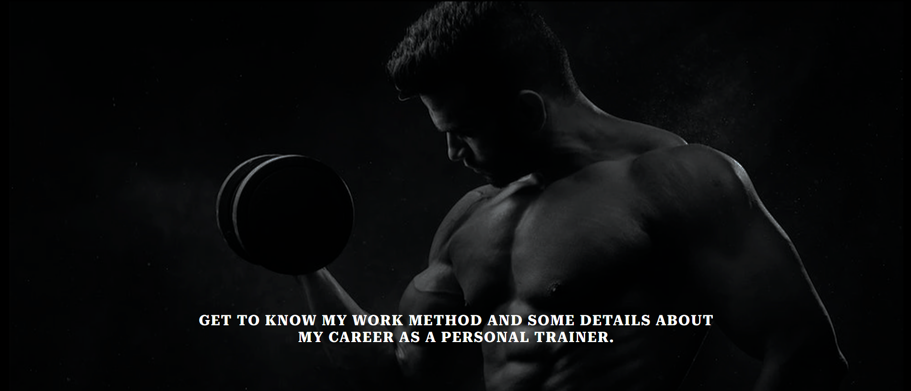

# Thiago Zanao Personal Trainer

Welcome to Thiago Zanao's Personal Trainer portfolio, your gateway to exploring the expertise of our top (fictional) Personal Trainer in Ireland. Discover more about the exceptional fitness journey that awaits you.

[Thiago Zanao WebSite](https://danijuniordev.github.io/zanao-personal/)

This webpage is designed to be a simple yet effective platform for a personal trainer. With responsiveness built into its design, it ensures accessibility across a wide range of devices.

## USER GOAL
To clearly see what the Zanao Personal services are.
Explore Your Customized Program: Tailored Fitness Solutions Just for You.
Motivation and Accountability: Empowering Your Fitness Journey with Inspiration and Commitment.
Technical Corrections: Ensuring Precision and Effectiveness in Your Fitness Program
Variety and Progression: Elevate Your Fitness Experience with Diverse Workouts and Steady Advancement.

#### Returning Visitor Goals
Create a fully functional and customized website, adding a personal touch. This platform not only enhances the owner's professional image but also provides users with the option to easily initiate contact and establish communication channels.

## FEATURES OF THE WEBSITE

### Navigation.
* Page links are centrally positioned in the header, subtly offset to the right for a visually appealing and user-friendly navigation experience.
* The page links feature a responsive design with a 'hover' animation, lighting up in a vibrant blue color when users hover over them. Once clicked, a distinct 'active' animation is applied, ensuring clarity by displaying a persistent blue border bottom to indicate the current page and enhance user navigation.
* The nav bar changes size and is readable when changing dimensions.

### Home - landing page.
* The webpage features a captivating hero image, complemented by an inspiring motivational phrase. This impactful combination sets the tone for a positive and engaging user experience.
* A section that clarifies and details the program designed by a personal trainer.

### About Me. 
* A captivating hero image paired with a powerful phrase encapsulating my unique and effective work methodology.
* 1 section featuring a personal photo accompanied by a brief narrative about myself, highlighting my journey and extensive experience as a dedicated personal trainer.

### Contact Us page.
* Background image and a complete contact form.

### Thank you page.

* After completing the form, upon submission, you will be directed to the thank-you page.

